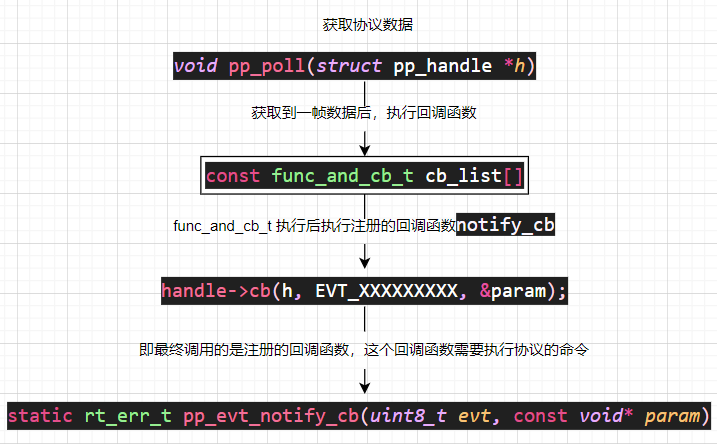

# 使用说明

## 文件夹说明

| 文件    | 说明                         |
| ------- | ---------------------------- |
| example | 测试文件，使用时克参考该文件 |
| inc     | 协议框架所有的H文件          |
| src     | 协议框架所有的C文件          |

## 使用说明

见 [README](../README.md)

## 协议框架函数调用关系

