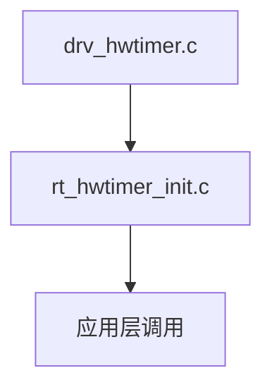

# device框架

以rt-thread的hwtimer为例。

## 结构体之间的联系

```c
struct rt_device
{
    struct rt_object          parent;                   /**< inherit from rt_object */

    enum rt_device_class_type type;                     /**< device type */
    rt_uint16_t               flag;                     /**< device flag */
    rt_uint16_t               open_flag;                /**< device open flag */

    rt_uint8_t                ref_count;                /**< reference count */
    rt_uint8_t                device_id;                /**< 0 - 255 */

    /* device call back */
    rt_err_t (*rx_indicate)(rt_device_t dev, rt_size_t size);
    rt_err_t (*tx_complete)(rt_device_t dev, void *buffer);

#ifdef RT_USING_DEVICE_OPS
    const struct rt_device_ops *ops;/**< 为软件层的驱动，将实际的驱动与软件驱动进行解耦 */
#else
    /* common device interface */
    rt_err_t  (*init)   (rt_device_t dev);
    rt_err_t  (*open)   (rt_device_t dev, rt_uint16_t oflag);
    rt_err_t  (*close)  (rt_device_t dev);
    rt_size_t (*read)   (rt_device_t dev, rt_off_t pos, void *buffer, rt_size_t size);
    rt_size_t (*write)  (rt_device_t dev, rt_off_t pos, const void *buffer, rt_size_t size);
    rt_err_t  (*control)(rt_device_t dev, int cmd, void *args);
#endif

#ifdef RT_USING_POSIX_DEVIO
    const struct dfs_file_ops *fops;
    struct rt_wqueue wait_queue;
#endif

    void                     *user_data;                /**< device private data */
};

/**
*衔接底层驱动：const struct rt_hwtimer_ops *ops
*设备配置信息：如freq、mode
*设备运行信息：如overflow、cycles
**/
typedef struct rt_hwtimer_device
{
    struct rt_device parent;//hwtimer的父结构，缓存一些通用属性。
    const struct rt_hwtimer_ops *ops;//衔接底层驱动，根据这个ops编写软件层的const struct rt_device_ops *ops
    const struct rt_hwtimer_info *info;//设备的一些信息

    rt_int32_t freq;                /* counting frequency set by the user */
    rt_int32_t overflow;            /* timer overflows */
    float period_sec;
    rt_int32_t cycles;              /* how many times will generate a timeout event after overflow */
    rt_int32_t reload;              /* reload cycles(using in period mode) */
    rt_hwtimer_mode_t mode;         /* timing mode(oneshot/period) */
} rt_hwtimer_t;
```

## 文件之间的联系



## 函数之前的联系

```c
//_hwtimer_ops赋值给rt_hwtimer_device内的ops
static const struct rt_hwtimer_ops _hwtimer_ops = {
    .init      = _hwtimer_init,
    .start     = _hwtimer_start,
    .stop      = _hwtimer_stop,
    .count_get = _hwtimer_counter_get,
    .control   = _hwtimer_ctrl,
};
//hwtimer_ops赋值给rt_hwtimer_device内的parent的ops
const static struct rt_device_ops hwtimer_ops =
{
    rt_hwtimer_init,
    rt_hwtimer_open,
    rt_hwtimer_close,
    rt_hwtimer_read,
    rt_hwtimer_write,
    rt_hwtimer_control
};
//这样通过层层赋值，实现了应用层对底层驱动的解耦
```

